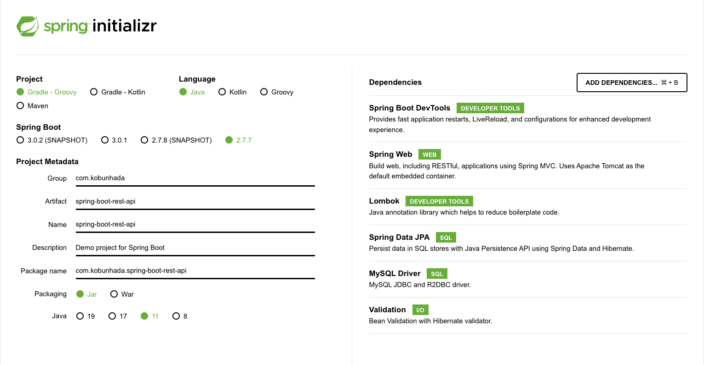

# springboot-examples
This repository is a simple example of a "SpringBoot"'s implementation.


## How to run application

To run this application, please execute the following operations after making preparations referring to the information described in the NOTE.

***I intend to describe in detail at a later date.***

1. MySQL-server start
    - Terminal
    ```zsh
    [xxxx.local]$ mysql.server start
    ```
    - DBeaver
    
    

2. On Intellij IDEA, right click on "spring-boot-rest-api/src/main/java/com/kobunhada/springbootrestapi.SpringBootRestApiApplication" and select "Run ' SpringBootRest. main()".
    - Run
    
    
3. Send "localhost:8080/api/v1/users/" by Postman.
    

## NOTE

### SpringBoot

The SpringBoot template was created by [spring initializr](https://start.spring.io/). It's configuration is as follows.



### IDE
I used by [Intellij IDEA Community Edition for Intel-Mac](https://www.jetbrains.com/idea/).


If you want to check the configuration of this app, open the "spring-boot-rest-api" directory in Intellij IDEA.

### Database

I used by MySQL(installed via Homebrew).

```zsh
[xxxxx@local ~]$ mysql --version
mysql  Ver 8.0.31 for macos13.0 on x86_64 (Homebrew)
[xxxxx@local ~]$
```

### Database-browser
I used [DBeaver](https://dbeaver.io/download/) for Intel-Mac.


### RestAPI Test Tool
I used [PostmanWeb + Postman Agent](https://www.postman.com/).


### About Configuration and Data

#### MySQL

|Item|Value|Note|
|:---|:---|:---|
|database|restapi_examples||
|user|root|default & administrator|
|password|kitaji|You can use any password :D|
|Table|users|This example used it only.|

restapi_examples.users definition

```sql
CREATE TABLE `users` (
  `id` int NOT NULL AUTO_INCREMENT,
  `family_name` varchar(100) NOT NULL,
  `first_name` varchar(100) DEFAULT NULL,
  `age` int DEFAULT '0',
  `address` varchar(200) DEFAULT NULL,
  `phone_number` varchar(100) DEFAULT NULL,
  PRIMARY KEY (`id`)
) ENGINE=InnoDB AUTO_INCREMENT=4 DEFAULT CHARSET=utf8mb4 COLLATE=utf8mb4_0900_ai_ci COMMENT='for RestAPI''s demo table.';

```
***You have to make data should be prepared according to the table definition.***


#### SpringBoot(Intellij IDEA)

spring-boot-rest-api/src/main/resources/application.properties
```
server.servlet.context-path=/api/v1
spring.jpa.hibernate.ddl-auto=update
spring.datasource.url=jdbc:mysql://localhost:3306/restapi_examples
spring.datasource.username=root
spring.datasource.password=kitaji
spring.datasource.driver-class-name=com.mysql.cj.jdbc.Driver
spring.jpa.show-sql=true
```
